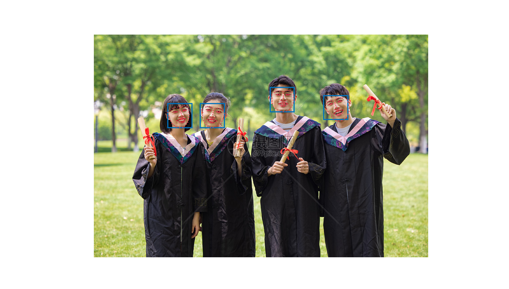

# 一、目标检测

## DETR

使用 `torch.hub` 中提供的 `detr_resnet50` 模型

```python
detr = torch.hub.load("facebookresearch/detr", "detr_resnet50", pretrained=True)
```

**结果图:**


# 二、人脸检测

## dlib

使用 `dlib` 提供的人脸检测模型

```python
detector = dlib.get_frontal_face_detector()
predictor = dlib.shape_predictor("path/to/shape_predictor_68_face_landmarks.dat")
```

**结果图:**


